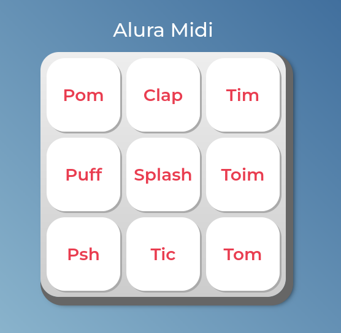

# AluraMidi 🔉
> Projeto Final do curso de JavaScript para Web: Crie páginas dinâmicas. Curso desenvolvido na Alura

- Junto à Alura, foi possível desenvolver o projeto, focado em JavaScript, aplicando funções, estruturas de reperição e estruturas condicionais 🌐

- O uso do DOM e Eventos em JavaScript também pode ser visto no código.

> O projeto está visando praticar os conceitos apresentados no curso.

> ### Redes Socias:
  
